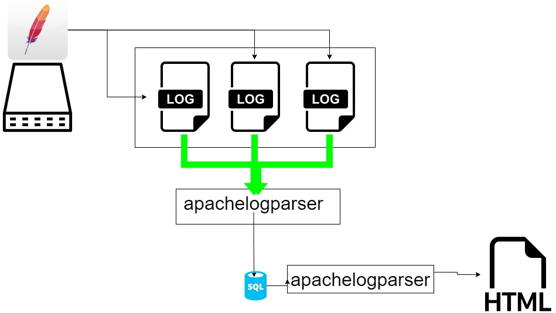

# apachelogparser

[](https://github.com/jorisvandenberg/apachelogparser/actions/workflows/go.yml) [](https://github.com/jorisvandenberg/apachelogparser/issues)  
[](https://github.com/jorisvandenberg/apachelogparser/releases/) [](#license) [](https://golang.org "Go to Go homepage") [](https://www.linux.org/ "Go to Linux homepage") [](https://www.sqlite.org/index.html "Go to SQLite homepage")  
**important: this project is currently in pre-alpha... Some parts work, others don't!!! It's useless to open issues at this point since everything is a work in progress!!!**  
combined logfile from apache parsing, putting all data in sqlite and visualising said data

## About The Project

I had an apache webserver running... All default... Combined log format... And i wanted some stats.  
In the open source world, i ended up with 3 choices:  

* awstats
* webalizer
* goaccess

all other tools seem to be worthless or paying. And those 3 were either allmost unmaintained, or not really what i wanted.  
So i tought to myself: why not add one more :smile:

## Visual schema



### Built With

golang

## Getting Started

It's a go program, vendoring included... just clone it, verify the sourcecode, build and run... Or use my precompiled binary's.

### Prerequisites

* go
* linux (eventough it should also be compileable on windows)
* apache combined logs
* space... Usually your logfiles will be rotated and gzipped. I'll be unpacking them and putting them into a relational database (which produces some more overhead). For every ~70 Mb of UNCOMPRESSED logs, you'll need about 100Mb of diskspace
* time. Eventough compiled go runs pretty fast :smile:. The initial testload of about ~70 Mb of logfiles took about 40 seconds on my old XEON dedicated server. That's about 1 second per 2 Mb of logfiles. Subsequent loads will mostly skip already loaded files and it'll skip records that are older than the newest timestamp in the db of changed logfiles.

### Installation

1. Clone the repo

   ```sh
   git clone https://github.com/jorisvandenberg/apachelogparser.git
   ```

1. build

   ```sh
   go build .
   ```

2. edit config.ini (you can swap out nano by vi or any other editor)

   ```sh
   nano config.ini
   ```

## Usage

1. build the sqlite database and fill it. You need to run this tool every time you want to load the ascii logs into the sqlite database for analysis/graphing

   ```sh
   ./apachelogparser
   ```

## License

Distributed under the Apache2.0 License.
