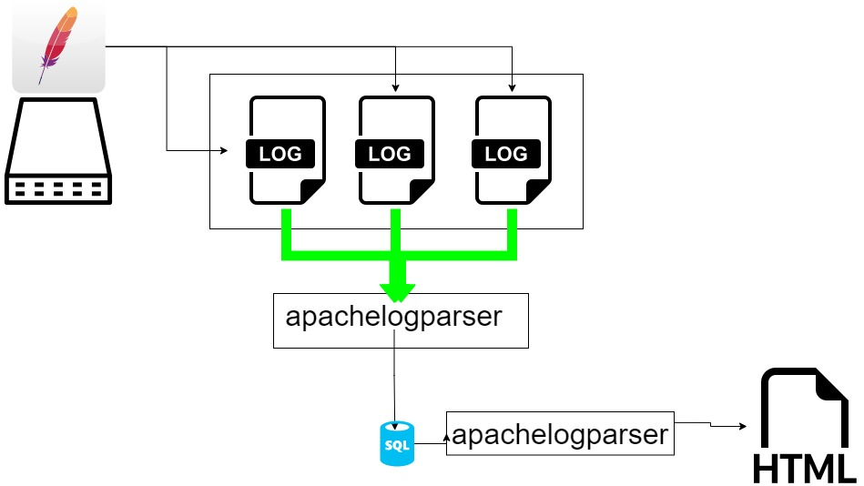

[](https://github.com/jorisvandenberg/apachelogparser/actions/workflows/go.yml) [](https://github.com/jorisvandenberg/apachelogparser/issues)  
[](https://github.com/jorisvandenberg/apachelogparser/releases/) [](#license) [](https://golang.org "Go to Go homepage") [](https://www.linux.org/ "Go to Linux homepage") [](https://www.sqlite.org/index.html "Go to SQLite homepage")  
**important: this project is currently in pre-alpha... Some parts work, others don't!!! It's useless to open issues at this point since everything is a work in progress!!!**  
combined logfile from apache parsing, putting all data in sqlite and visualising said data

## About This Project

I had an apache webserver running... All default... Combined log format... And i wanted some stats.  
In the open source world, i ended up with 3 choices:  

* awstats
* webalizer
* goaccess

All other tools seem to be worthless or paying. And those 3 were either allmost unmaintained, or not really what i wanted.  
So i tought to myself: why not add one more :smile:  
_remark_: there are tons of tools that are better than my tool... Personally, i'm a big fan of matomo and google analytics. However, these tools need to be "installed" on your site (trough a call in the head section of your page, or directly into the code,...). This tool does not give you the in-depth analysis matomo or GA give you, but it works on the raw log files. The benefit of this is that you do not need to install anything on your site and you capture all requests that reach your server (whilst, running GA or an equivalent tool might miss calls to pages that don't have their tracking code installed)

## Visual schema



### Built With

golang

## Getting Started

### compiling from source

It's a go program, vendoring included... just clone it, verify the sourcecode, build and run...

```bash
git clone git@github.com:jorisvandenberg/apachelogparser.git
cd apachelogparser
go build .
```

### installing a pre-compiled binary

* visit the [releases page](https://github.com/jorisvandenberg/apachelogparser/releases)
* download the latest release in
  * binary format (apachelogparser-vx.x.x-linux-amd64.tar.gz) or (apachelogparser-vx.x.x-windows-amd64.tar.gz) _the windows version is currently untested_
  * rpm (install with `rpm -Uvh package.rpm`)
  * deb (install with `dpkg -i package.deb`)

if you download the binary, you'll manually have to create the config directory /etc/apachelogparser and put the config.ini and template_config.ini from the repository in said directory. If you used an installer, this step will be executed for you

### creating the config.ini

the tool has a "wizard" included. Currently it's a very basic wizard tough!

```bash
apachelogparser -iniwizard
```

you'll be prompted wether or not you want a minimal install... currently the default is "n", but for a first time user, answering "y" might not be such a bad idear :wink:

the questions from the minimal install wizard are _really_ basic, and should be trivial for anyone that is competent to run this parser:

* general.dbpath : the full path, including the db file where you want the tool to save the sqlite3 database. A relative path is valid, but discouraged... An example would be /etc/apachelogparser/mydb.db
* general.mydomain: your top level domain (mydomain.com)
* input.logfilepath: in which path can the tool find your logfiles? Usually something like /var/log/apache2/. DO NOT FORGET THE TRAILING SLASH!!!
* input.logfileregex: valid golang regex that tells the tool which logfiles it has to parse. If you only run one domain on your host, something like `.*acces.*` is usually enough. If you run vhosts that all log into different logfiles, and you want to keep them seperated, you'll probably have to look into the filenames of these logfiles... In my democase, i run vhosts, and merel.mobi logs info files that match this regex: `^merel\.mobi\.acces.*`.
* output.outputpath: where do you want the tool to write the output to? Somewhere in your webroot might be nice? /var/www/html/? It's up to you tough!

that's all folks...

### security

the tool does not run as a daemon. It's not listening on any ports and it's completely open source... Even the database is an sqlite3 database which you can open with basic tools available for any OS. This being said: if there's a critical vulnerability in this tool, i take no responsability. Same with errors in the stats: if you find them, open an issue or fix them yourselfs (i'm not going to reimburse you).  
  
the took generates static html files. These files are just static files, so they should be relatively safe. We do use an external javascript library for graphing. If you don't trust this, you'll have to host this javascript library yourself or disable all graphs (and only use the tables... Which also use an external javascript for sorting... so you'll have to modify the sourcecode to exclude the tablesorter)  

if you want other people snooping around your stats, your can look into htaccess security for the output folder... it isn't always the best security, but generally speaking it's good enough for stats... If you don't want this: don't put the output directory in the webroot...

### vhosts

it's possible to duplicate the config.ini and modify the input.logfileregex, general.dbpath, general.mydomain and output.outputpath for each vhost. Then instead of executing `apachelogparser`, you have to execute `apachelogparser -config yourconfigname.ini`

### scheduling

it's up to you... you can run this tool manually on call. Just make sure you run it often enough... Once apache logfiles are rotated, their content is gone... I personally rotate on a 10 day basis, so if i run this tool every week, i'm perfectly fine...
Other than that: it's up to your OS... Crontab, systemd scheduling, scheduled tasks,...

## Prerequisites to build and run

* go (only if you plan to build the binary from source)
* linux (eventough it should also be compileable on windows)
* apache combined logs
* space... Usually your logfiles will be rotated and gzipped. I'll be unpacking them and putting them into a relational database (which produces some more overhead). For every ~70 Mb of UNCOMPRESSED logs, you'll need about 100Mb of diskspace
* time. Eventough compiled go runs pretty fast :smile:. The initial testload of about ~70 Mb of logfiles took about 40 seconds on my old XEON dedicated server. That's about 1 second per 2 Mb of logfiles. Subsequent loads will mostly skip already loaded files and it'll skip records that are older than the newest timestamp in the db of changed logfiles.

## Usage

1. build the sqlite database and fill it. You need to run this tool every time you want to load the ascii logs into the sqlite database for analysis/graphing

```sh
./apachelogparser
```

## License

Distributed under the Apache2.0 License.
